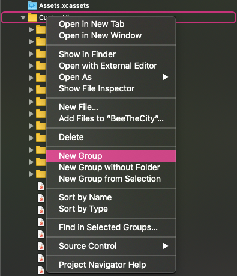
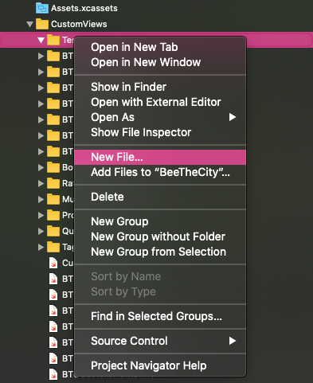
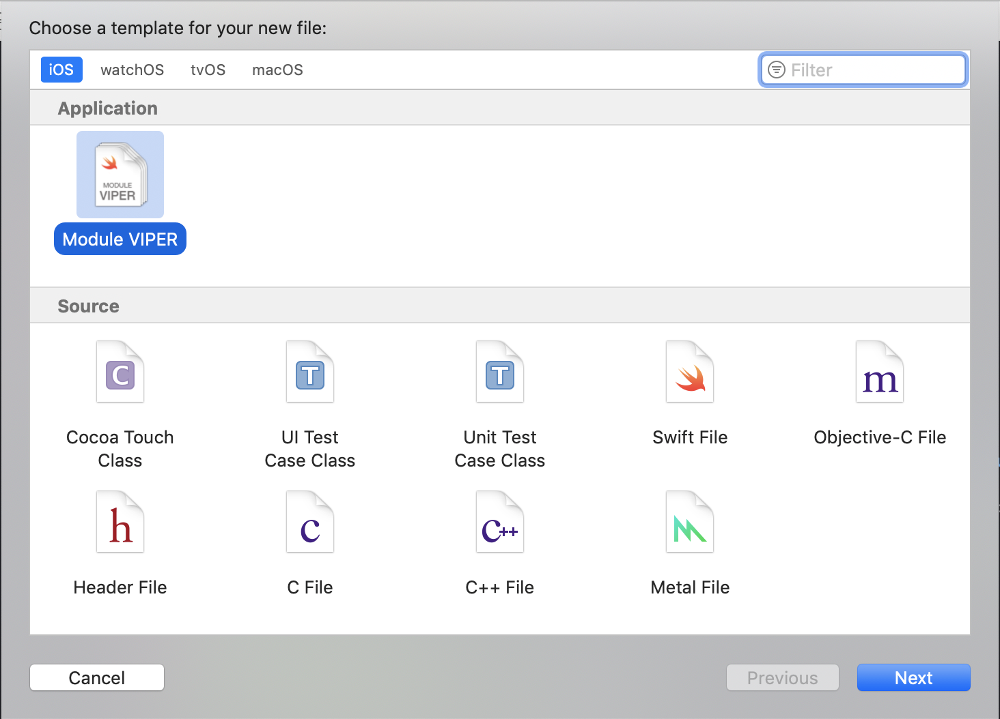
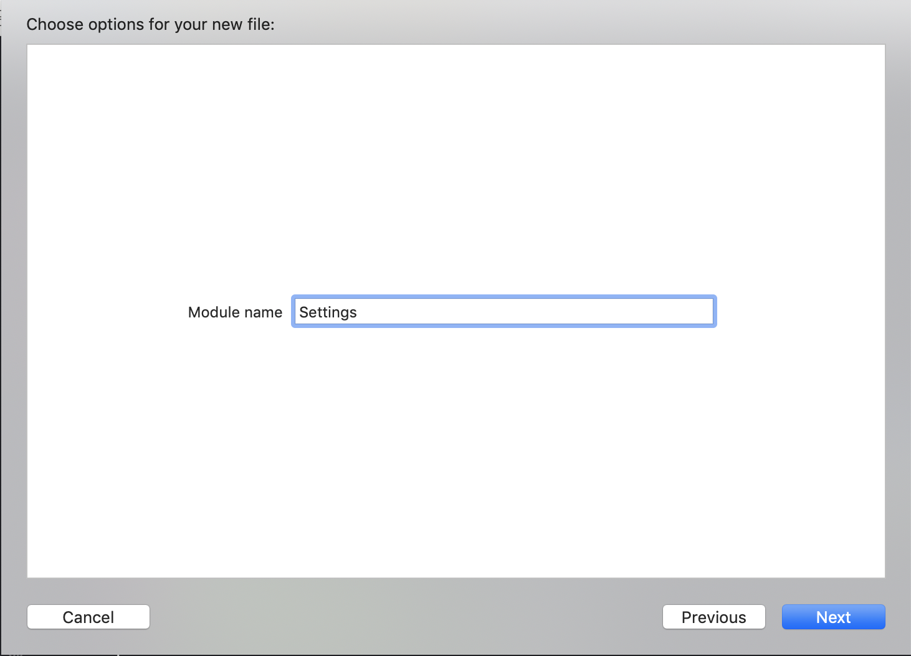
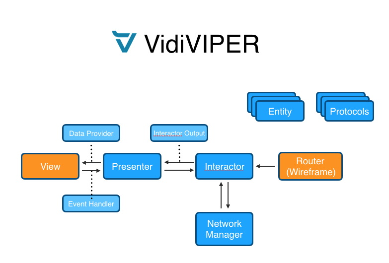

# Xcode template to create VIPER modules

## How to install

Clone the repository, cd into it and then launch the install bash script.

```
sh install.sh
```

Input your root password and you are done!

## Generated code
This template generates these files:

- `_ModuleName_Entities.swift`
- `_ModuleName_Interactor.swift`
- `_ModuleName_NetworkManager.swift`
- `_ModuleName_Presenter.swift`
- `_ModuleName_Protocols.swift`
- `_ModuleName_ViewController.swift`
- `_ModuleName_ViewController.xib` or ` _ModuleName_ViewController.storyboard`
- `_ModuleName_Wireframe.swift`

It sets up some boilerplate as well, connecting and allocating things.

## Usage instruction

### 1. Create a new Group
Unfortunately it's not possible to create folders with an Xcode templates, so the first action is to create one manually.

Right click on the folder you want to create the module and select `New Group`. Give to the group the name of the VIPER module you want to create.  

  

### 2. Create the Module
Select the Group you just created and choose `New File...`   

<br/>

Then select `Module VIPER`

<br/>

Type in the module name and select Storyboard or XIB

<br/>

Press `Next` and then create the Module.

## Files responsabilities and brief description

<br/>

- `_ModuleName_ViewController.swift` (View) is passive and doesn't do much on its own. Its sole responsibility is to message events to the presenter and display UI elements;
- `_ModuleName_Interactor.swift` (Interactor) is a UIKit-independent component that performs all business logic. It uses its NetworkManager instance to retrieve and pass data to / from the network APIs. Pass all kind of information and errors to ` _ModuleName_Presenter.swift` through Interactor Output instance, with defined methods in interactor output protocol in `_ModuleName_Protocols.swift`;
- `_ModuleName_Presenter.swift` (Presenter) is (should be) UIKit-independent. It receives messages from the view and decides whether to send messages to the interactor or the router. It also receives the data from the interactor and prepares it for the view to display in the suitable format;
- `_ModuleName_Entities.swift` (Entity) is a plain model that’s used by the interactor: descriptors, UI descriptors, module errors;
- `_ModuleName_Wireframe.swift` (Router / Wireframe) it is responsible for creating a particular module and navigating from one module to another. It's the module entry and exit point.
- `_ModuleName_Protocols.swift` (Contracts) list of all module protocols.<br/>

Have fun! 🍪🦄🚀


## Release History

* 0.2.0
  * CHANGES:
    * Update README.md
    * Add MARK in code
    * Code refactor with less boilerplate

* 0.1.0
    * CHANGES: Readme.md

* 0.0.1
    * Work in progress

## Meta
Vidiemme - [www.vidiemme.it](https://www.vidiemme.it) - info@vidiemme.it

Distributed under the MIT license. See ``LICENSE`` for more information.

[https://github.com/vidiemme/](https://github.com/vidiemme/)

## Contributing

1. Fork it (<https://github.com/vidiemme/VIPER-Module-Template-Swift/fork>)
2. Create your feature branch (`git checkout -b feature/fooBar`)
3. Commit your changes (`git commit -am 'Add some fooBar'`)
4. Push to the branch (`git push origin feature/fooBar`)
5. Create a new Pull Request
